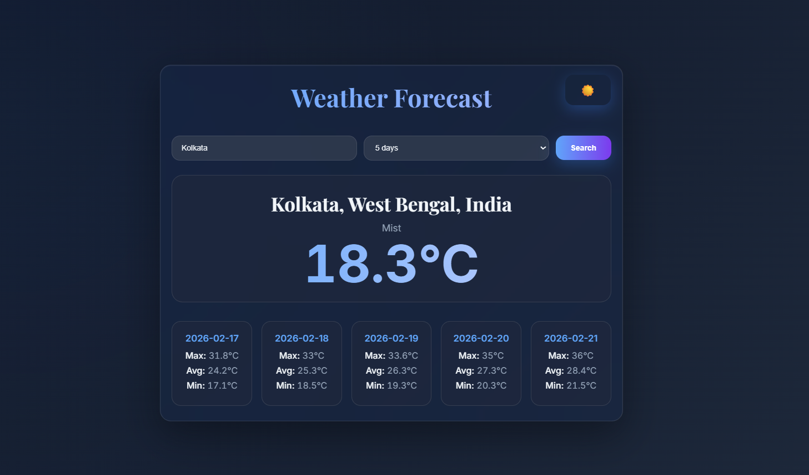

🌦 Weather Application – Spring Boot + Forecast API
## 📸 Screenshots

📌 Overview

Weather Application is a full-stack REST API project built using Spring Boot that consumes an external Weather API and provides:

🌍 Current Weather Data

📅 Multi-Day Forecast

🎨 Beautiful Interactive Frontend

🔐 Secure API Key Management

This project demonstrates strong understanding of:

REST API Development

API Consumption (RestTemplate)

DTO Mapping

JSON → Java Object Conversion

Exception Handling

Git & Version Control

🚀 Features

✅ Get current weather by city
✅ Get forecast for 3–7 days
✅ Clean DTO-based architecture
✅ Proper layered structure (Controller → Service → DTO)
✅ Exception handling
✅ External API integration
✅ Modern responsive frontend
✅ Dark glass UI design
🏗 Project Architecture
Client (Frontend)
↓
Controller Layer
↓
Service Layer
↓
External Weather API (API Consumer)
API Endpoints
🔹 Get Current Weather
GET /weather/my/{city}

Example:

GET /weather/my/kolkata

🔹 Get Forecast
GET /weather/forecast?city=kolkata&days=3

🧠 Tech Stack

Java 23

Spring Boot 3

REST API

RestTemplate

Maven

HTML + CSS + JavaScript

WeatherAPI (External API)

Git & GitHub
📂 Project Structure
src/main/java/com/example/Weather_Application
│
├── controller
├── service
├── dto
└── WeatherApplication.java
🔄 How It Works (Internally)

User sends request → /weather/forecast

Controller receives request

Service calls external Weather API

JSON response is converted into Java DTO objects

Custom response object is created

Data returned as JSON

Frontend displays data dynamically

🔐 Configuration

Create application.properties:

weather.api.key=YOUR_API_KEY
weather.api.url=http://api.weatherapi.com/v1/current.json
weather.api.forecast.url=http://api.weatherapi.com/v1/forecast.json

⚠ Do NOT push real API key to GitHub.

🛠 How to Run
git clone <your-repo-url>
cd Weather_Application
mvn spring-boot:run

Application runs on:

http://localhost:8081

📊 Sample Response
{
"weatherResponse": {
"city": "Kolkata",
"region": "West Bengal",
"country": "India",
"condition": {
"text": "Mist"
},
"temperature": 23.2
},
"dayTemp": [
{
"date": "2026-02-12",
"minTemp": 17.2,
"avgTemp": 24.1,
"maxTemp": 31.8
}
]
}

🎯 What I Learned

How JSON is mapped into Java Objects

How Spring Boot handles Dependency Injection

API Consumer vs Provider concept

Exception Handling in REST APIs

Git version control and deployment

👨‍💻 Author

Sk Sayel Abbash
B.Tech CSE
Backend Developer (Java + Spring Boot)

